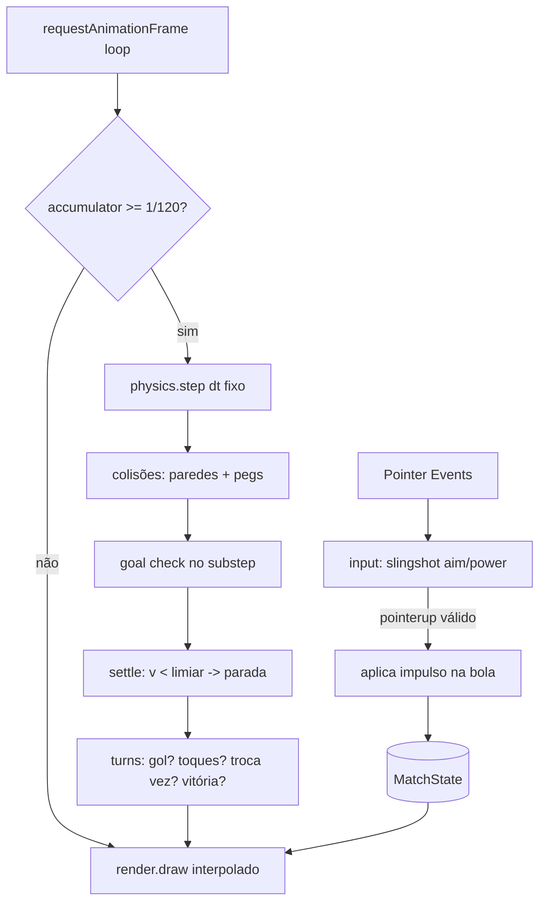

# Core Gameplay Design

**Spec**: `.specs/features/core-gameplay/spec.md`
**Status**: Draft

---

## Architecture Overview

Núcleo 100% client-side num único `<canvas>`. Um **game loop** com `requestAnimationFrame` roda um **acumulador de timestep fixo** (física a 1/120s, render interpolado). Todo o jogo vive num objeto de estado central (`MatchState`); os módulos são funções quase puras que leem/mutam esse estado. Nada de framework nem engine de física.

**Sistema de coordenadas:** o campo vive em *world units* — um playfield lógico fixo em retrato (ex.: 600×900). O render escala/centra esse mundo na viewport (`scale = min(cw/600, ch/900)`), então a física é independente do tamanho da tela e o redimensionamento só recalcula a transformação (sem perder estado).



---

## Code Reuse Analysis

Projeto greenfield — não há código existente para reusar. As referências abaixo são acordos **internos** de reuso entre módulos desta feature e a `match-flow-ui`.

### Componentes a alavancar (internos)

| Componente | Origem | Como usar |
|---|---|---|
| `MatchState` + enum de fases | Compartilhado com `match-flow-ui` | Fonte única de verdade; HUD (FLOW-04) lê `currentTeam`/`touchesLeft` daqui |
| `Team` (code/name/flag/cores) | `teams.js` (`match-flow-ui`, D-13) | `core-gameplay` recebe `teamA`/`teamB` já resolvidos; usa só cor+número no render |
| Transformação world→screen | `render.js` (criada aqui) | Reusada por overlays de HUD e comemoração |

### Integration Points

| Sistema | Método de integração |
|---|---|
| `match-flow-ui` (menu/seleção/config) | Chama `startMatch(teamA, teamB, {touchesPerTurn, goalsToWin})` que monta `MatchState` e entra na fase `playing` |
| HUD (FLOW-04) | Lê o `MatchState` (placar, vez, toques); recebe evento `onGoal`/`onWin` para overlays |
| Tela de fim (CORE-06) | `core-gameplay` emite `phase = gameover`; `match-flow-ui` renderiza a tela e chama `restartMatch()` ou volta a `select` |

---

## Components

### `game.js` — Loop e máquina de fases
- **Purpose**: orquestra loop com timestep fixo e transições de fase.
- **Location**: `src/game.js`
- **Interfaces**:
  - `startMatch(teamA, teamB, config): void` — monta `MatchState`, posiciona bola/pegs, define saída, fase `playing`.
  - `loop(timestampMs): void` — acumulador; chama `physics.step` N vezes, depois `render.draw(alpha)`.
  - `setPhase(phase): void` — transições válidas entre `playing | ballMoving | goal | gameover`.
  - `restartMatch(): void` — zera placar, mantém times/config (usado por CORE-06).
- **Dependencies**: `physics`, `render`, `turns`, `input`, `MatchState`.
- **Reuses**: enum de fases compartilhado.

### `physics.js` — Integração + colisões
- **Purpose**: avança a bola com atrito alto e resolve colisões sem tunneling.
- **Location**: `src/physics.js`
- **Interfaces**:
  - `step(state, dt): GoalEvent | null` — integra a bola, faz substeps, resolve paredes e pegs, detecta cruzamento de linha de gol; retorna gol (lado) ou null.
  - `applyImpulse(ball, vx, vy): void` — define velocidade no peteleco.
  - `isBallStopped(ball): boolean` — true quando `speed < V_STOP` por `STOP_FRAMES` passos.
  - `reflectCircleWall(ball, segment, restitution)` / `reflectCircleCircle(ball, peg, restitution)` — resolução + correção posicional (empurra a bola para fora).
- **Dependencies**: geometria da arena (paredes como segmentos + arcos dos cantos; aberturas de gol).
- **Reuses**: constantes de calibragem (damping, restituição, limiares).

### `arena.js` — Geometria do campo
- **Purpose**: define a arena (retângulo arredondado com aberturas de gol — D-02) e posições fixas dos 10 pegs (D-06).
- **Location**: `src/arena.js`
- **Interfaces**:
  - `buildArena(playfield): { walls: Segment[], corners: Arc[], goals: {top, bottom} }`
  - `buildPegs(playfield): Peg[]` — 5 por time, formação fixa espelhada, com `number`.
  - `goalLine(side): { y, xMin, xMax }` — linha entre as traves para detecção.
- **Dependencies**: dimensões do playfield.
- **Reuses**: usado por `physics` (colisão/gol) e `render` (desenho).

### `input.js` — Pointer Events (slingshot)
- **Purpose**: traduz arrasto a partir da bola em direção+força (estilingue).
- **Location**: `src/input.js`
- **Interfaces**:
  - `attach(canvas, state, onFlick): void` — registra `pointerdown/move/up/cancel`.
  - `getAim(state): { dir, power, dragLen } | null` — para a linha-guia no render.
- **Comportamento**: `pointerdown` só inicia mira se cair sobre a bola (raio + margem de toque). `dir = normalize(ballPos − pointerPos)` (puxa pra trás). `power = clamp(dragLen, 0, MAX_DRAG) → impulso` com teto. `pointerup`: `dragLen < MIN_DRAG(15px)` → ignora (não consome toque); senão `onFlick(dir, power)`. Entrada bloqueada quando `phase === ballMoving`.
- **Dependencies**: transformação screen→world de `render`.
- **Reuses**: mesma transformação do render (consistência mouse/touch).

### `turns.js` — Turnos, gol, placar, vitória
- **Purpose**: máquina de regras após cada peteleco/parada.
- **Location**: `src/turns.js`
- **Interfaces**:
  - `consumeTouch(state): void` — `touchesLeft--`; chamado num peteleco válido.
  - `onBallSettled(state): void` — sem gol: se `touchesLeft === 0` troca vez (bola fica onde parou), senão mantém vez.
  - `registerGoal(state, scoringTeam): void` — `score++`, reposiciona bola no centro, dá saída a quem sofreu (D-03), checa vitória.
  - `checkWin(state): 'A' | 'B' | null` — `score >= goalsToWin`.
  - `attributeGoal(state, goalEvent): 'A' | 'B'` — resolve gol contra → adversário (D-04).
- **Dependencies**: `MatchState`, `arena.goalLine`.
- **Reuses**: constantes de config (`touchesPerTurn`, `goalsToWin`).

### `render.js` — Canvas (visão de cima)
- **Purpose**: desenha campo, gols, 10 pegs (cor+número) e bola; linha-guia de mira.
- **Location**: `src/render.js`
- **Interfaces**:
  - `resize(canvas): void` — recalcula `scale`/offset world→screen; sem perder estado.
  - `draw(state, alpha): void` — desenha cena com interpolação de render.
  - `worldToScreen(p)` / `screenToWorld(p)` — usadas por input e overlays.
- **Dependencies**: `arena`, `MatchState`, aim de `input`.
- **Reuses**: transformação única compartilhada.

---

## Data Models

```typescript
type Phase = 'menu' | 'select' | 'config' | 'playing' | 'ballMoving' | 'goal' | 'gameover'

interface Ball { x: number; y: number; vx: number; vy: number; radius: number; px: number; py: number /* prev p/ interpolação */ }

interface Peg { x: number; y: number; radius: number; team: 'A' | 'B'; number: number /* estático */ }

interface Team { code: string; name: string; flag: string; colorPrimary: string; colorSecondary?: string } // de teams.js

interface MatchState {
  teamA: Team; teamB: Team
  scoreA: number; scoreB: number
  goalsToWin: 3 | 5
  touchesPerTurn: 1 | 2 | 3
  currentTeam: 'A' | 'B'
  touchesLeft: number
  phase: Phase
  ball: Ball
  pegs: Peg[]
  winner: 'A' | 'B' | null
}
```

**Relationships**: `MatchState` é o agregado raiz; `Team` vem de config (`teams.js`); `Ball`/`Peg` derivam do playfield via `arena.js`. `pegs` é imutável durante a partida (D-01).

---

## Error Handling Strategy

| Cenário | Tratamento | Impacto p/ usuário |
|---|---|---|
| Bola em alta velocidade (risco de tunneling) | Substeps: subdividir o passo para a bola andar ≤ `radius/2` por sub-passo; checar parede/peg/gol a cada sub-passo | Bola nunca atravessa nem some |
| Bola "presa" oscilando (micro-velocidade) | `isBallStopped`: `speed < V_STOP` por `STOP_FRAMES` consecutivos → zera v | Jogada assenta rápido, sem travar a vez |
| Arrasto acidental (< 15px) | `input` ignora; não dispara nem consome toque | Sem peteleco fantasma |
| Peteleco com bola em movimento | `input` bloqueado em `phase === ballMoving` | Entrada só após a bola parar |
| Gol contra (bola no próprio gol) | `attributeGoal` credita ao adversário (D-04) | Ponto vai ao oponente |
| Resize/rotação no meio da partida | `render.resize` recalcula só a transformação; física em world units intacta | Campo reescala sem perder placar/posições |
| Bola para na boca do gol sem cruzar a linha | Gol só conta no cruzamento da `goalLine` entre as traves | Não conta; jogada segue |

---

## Tech Decisions (não-óbvias)

| Decisão | Escolha | Racional |
|---|---|---|
| Arena oval | Retângulo arredondado (segmentos + arcos de canto) com aberturas de gol | Mais simples e estável que elipse verdadeira (PRD §13); colisão por segmento/arco é robusta |
| Anti-tunneling | Substeps por distância (≤ radius/2), não CCD analítico | Suficiente para círculos estáticos; barato e estável |
| Atrito | Damping exponencial por passo (`v *= DAMP`) + corte por limiar | Imita a pastilha de madeira; calibragem empírica (STATE todo) |
| Detecção de gol | No substep de física, por cruzamento de linha | Não perde gol de bola rápida (D-12) |
| Coordenadas | World units fixas + transformação no render | Física independente de DPI/tamanho; resize trivial |
| Pegs estáticos na colisão | Reflexão círculo-círculo só altera a bola; peg imóvel | Regra do peteleco (D-01); evita resolver massa/momento |

**Constantes a calibrar (empírico — registradas em STATE):** `DAMP`, `MAX_DRAG`, `IMPULSE_SCALE`, `RESTITUTION_WALL`, `RESTITUTION_PEG`, `V_STOP`, `STOP_FRAMES`, `MIN_DRAG≈15px`, `BALL_RADIUS`, `PEG_RADIUS`, geometria do gol.

---

## Requirement Coverage

| Req | Onde é atendido |
|---|---|
| CORE-01 (render) | `render.js`, `arena.js` |
| CORE-02 (física) | `physics.js` (integração, colisões, substeps, settle, timestep fixo) |
| CORE-03 (slingshot) | `input.js` |
| CORE-04 (turnos) | `turns.js` (`consumeTouch`, `onBallSettled`) |
| CORE-05 (gol/placar/reposição) | `physics.step` (cruzamento) + `turns.registerGoal`/`attributeGoal` |
| CORE-06 (vitória/fim) | `turns.checkWin` + `game.setPhase('gameover')`/`restartMatch` |
