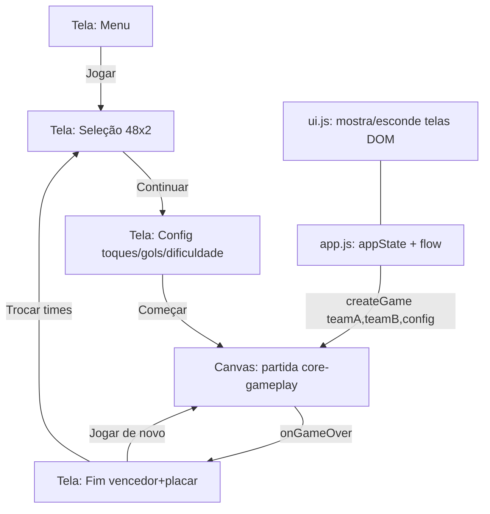

# Match Flow & UI Design

**Spec**: `.specs/features/match-flow-ui/spec.md`
**Status**: Draft

---

## Architecture Overview

As telas de fluxo (menu, seleção, config, fim) são **overlays DOM** sobre o `<canvas>` do jogo — não desenhadas no canvas. Motivo: acessibilidade (botões reais ≥48px, fonte ≥18px, grade rolável de 48 itens, foco/teclado) e responsividade são muito mais simples e robustas em DOM/CSS do que em canvas, atendendo FLOW-05 diretamente. Continua sem framework de UI (só DOM + CSS), coerente com o PRD §8.

Um orquestrador (`app.js`) mantém o estado de aplicação (times escolhidos + config) e dirige a máquina de fases de alto nível. O núcleo (`core-gameplay`) vira o **motor da partida**: recebe times+config, roda `playing/ballMoving/goal` e avisa o app no fim via callback.



Fases DOM (`appPhase`): `menu | select | config | match | gameover`. A fase interna do match (`playing/ballMoving/goal/gameover` em `MatchState`) é do core; o app só observa o `onGameOver`.

---

## Code Reuse Analysis

### Componentes existentes a alavancar

| Componente | Local | Como usar |
|---|---|---|
| `createGame(canvas, state, opts)` | `src/game.js` | Motor da partida; estender com `opts.manageScreens=false` e `opts.onGameOver` |
| `createMatchState(teamA, teamB, config)` | `src/state.js` | Monta o estado com times+config+dificuldade |
| `DIFFICULTIES` / `getDifficulty` | `src/difficulty.js` | Seletor de dificuldade da tela de config |
| `teams.js` | `src/teams.js` | Expandir de placeholder p/ 48 (provisório, editável — B-01/D-13) |
| HUD canvas | `game.js` | Mantido durante a partida (FLOW-04) |

### Integration Points

| Sistema | Integração |
|---|---|
| `core-gameplay` (motor) | `app` cria/destrói o `game`; passa times+config; recebe `onGameOver(winner)` |
| Seletor de dificuldade do core (canvas, fase `config`) | **Substituído** pela tela DOM de config; com `manageScreens=false` o core não desenha mais config/gameover nem trata seus toques |

---

## Components

### `teams.js` — Dados das seleções (expandido)
- **Purpose**: lista **provisória** de 48 seleções reais (bandeira emoji + nome pt-BR + cores), editável; substituir pela lista oficial quando a classificação 2026 fechar (B-01).
- **Location**: `src/teams.js`
- **Interfaces**: `TEAMS: Team[]` (48), `getTeam(code)`, `withDistinctColor(team, takenColor)` (força cor distinta quando os dois escolhem igual — FLOW-02).
- **Reuses**: formato `Team` do PRD §10.

### `ui.js` — Telas DOM
- **Purpose**: cria e controla os overlays de menu, seleção, config e fim; emite eventos para o app.
- **Location**: `src/ui.js`
- **Interfaces**:
  - `createUI(root, handlers): UI` — `handlers = { onStart(teamA, teamB, config), onRematch(), onChangeTeams() }`.
  - `ui.show(appPhase, data)` / `ui.hide()` — mostra a tela da fase.
  - `ui.renderTeamGrid(side)` — grade rolável de 48 (flag+nome+code+swatch de cor); seleção em 1 toque; destaque.
  - `ui.showGameOver(winner, scoreA, scoreB, teams)`.
- **Dependencies**: `teams.js`, `difficulty.js`, DOM/CSS do `index.html`.
- **Reuses**: tokens de cor/acessibilidade do CSS.

### `app.js` — Orquestrador (novo entry)
- **Purpose**: máquina de fases de alto nível; mantém `appState` e liga `ui` ↔ `game`.
- **Location**: `src/app.js` (substitui o boot de `main.js`)
- **Interfaces**: `boot()` — monta UI, começa no menu; `startMatch()` cria o `game` com times+config; `onGameOver(winner)` mostra a tela de fim.
- **Dependencies**: `ui.js`, `game.js`, `state.js`, `teams.js`.

### `game.js` — Motor (ajuste)
- **Mudança**: `createGame(canvas, state, opts={})`. Com `opts.manageScreens===false`, não desenha `drawConfig`/`drawGameOver` nem trata seus toques; ao entrar em `gameover`, chama `opts.onGameOver(state.winner)` uma vez. HUD permanece. Mantém compatibilidade (default `manageScreens=true`).

### `index.html` — Containers + CSS
- **Mudança**: adicionar `#ui-root` com as quatro telas (escondidas por `hidden`/classe) e CSS acessível (alvos ≥48px, fonte ≥18px, alto contraste, grade responsiva). Trocar `main.js` por `app.js`.

---

## Data Models

```typescript
interface AppState {
  phase: 'menu' | 'select' | 'config' | 'match' | 'gameover'
  teamACode: string | null
  teamBCode: string | null
  config: { touchesPerTurn: 1|2|3; goalsToWin: 3|5; difficulty: 'facil'|'medio'|'dificil' }
  game: GameHandle | null
}
```

`Team` (PRD §10) inalterado. Quando `teamACode === teamBCode`, o app deriva `teamB` com `withDistinctColor` antes de `createMatchState` (FLOW-02 AC2).

---

## Error Handling Strategy

| Cenário | Tratamento | Impacto |
|---|---|---|
| "Continuar" sem ambos escolhidos | Botão `disabled` até J1 e J2 terem seleção | Não avança |
| Os dois escolhem o mesmo país | `withDistinctColor` força cor 2ª distinta no time B | Times distinguíveis |
| Bandeira emoji não renderiza (ex.: 🏴 subdivisões) | Fallback: code de 3 letras sempre visível ao lado | Time ainda identificável |
| Rotação/resize durante telas | Layout CSS fluido (flex/grid), sem estado perdido | Reescala sem quebra |
| Tela < 360px | Grade responsiva (auto-fit), alvos mantêm ≥48px | Usável em 320px |
| Voltar do gameover p/ seleção | App destrói/para o `game` atual antes de reabrir telas | Sem loop duplicado |

---

## Tech Decisions (não-óbvias)

| Decisão | Escolha | Racional |
|---|---|---|
| Menus em DOM (não canvas) | Overlays HTML/CSS sobre o canvas | Acessibilidade (FLOW-05) e grade de 48 muito mais simples/robusta; sem framework |
| Núcleo como motor | `manageScreens=false` + `onGameOver` | Mantém `core-gameplay` reutilizável; evita 2 UIs de fim conflitando |
| Lista das 48 | Provisória, real, editável, flagada | B-01: lista oficial pendente; PRD proíbe inventar a *oficial*, mas a grade precisa de dados — config editável é o caminho previsto (D-13) |
| Mesmo país | `withDistinctColor` no app | FLOW-02 AC2; mantém cor+número como identificadores |

---

## Requirement Coverage

| Req | Onde é atendido |
|---|---|
| FLOW-01 (menu) | `ui.js` (menu), `app.js` |
| FLOW-02 (seleção 48) | `ui.renderTeamGrid`, `teams.js` (48 + `withDistinctColor`) |
| FLOW-03 (config: toques/gols/dificuldade) | `ui.js` (config), `difficulty.js` |
| FLOW-04 (HUD) | `game.js` HUD (já existe) durante `match` |
| FLOW-05 (acessibilidade) | CSS do `index.html` (alvos/fonte/contraste), code+flag juntos |
